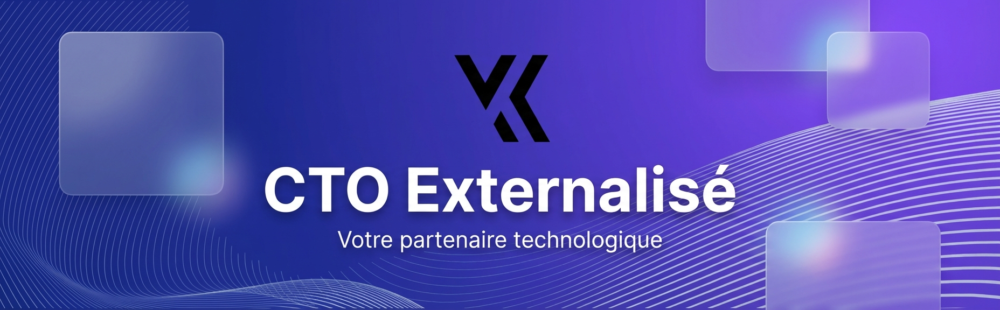

# Yavuz KUTUK
### Yavuz KUTUK – CTO | Tech Lead | Expert Web & Mobile

### Depuis maintenant plus de 20 ans,
Avec plus de 20 ans d’expérience dans le développement web, mobile et la gestion de projets digitaux, je combine une expertise technique approfondie à une solide vision stratégique.

💡 Fondateur et CTO, j’ai accompagné de nombreuses entreprises – startups, PME, grands comptes – dans la conception, le développement et la scalabilité de leurs solutions numériques.
Spécialisé en Next.js, React, Node.js, Strapi, et Symfony, j’interviens également sur des sujets de performance, sécurité, UX et SEO.

### Compétences clés
- [x] Leadership technique et accompagnement d’équipes pluridisciplinaires
- [x] Expertise fullstack JS (Next.js, React, Express) & PHP (Symfony)
- [x] Intégration d’APIs, CRM, tunnels e-commerce & systèmes sur-mesure
- [x] Veille active, innovation continue et approche orientée résultats
- [x] Pédagogie, communication fluide et accompagnement client de bout en bout

### Habilitation jury

- [x] 🏅 Concepteur développeur d'applications (🗓️ **mai 2021 par DREETS Grand-Est**)

- [x] 🏅 Développeur Web, Web Mobile (🗓️ **mars 2019 par DREETS Grand-Est**)

### Liens
- [kutuk.fr](https://kutuk.fr)
- [Linkedin](https://fr.linkedin.com/in/yavuzkutuk)
- [Twitter](https://twitter.com/yavuzkutuk)
