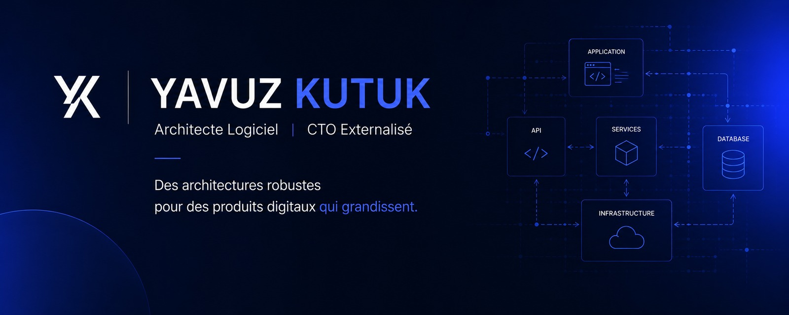

20 ans à concevoir, développer et faire scaler des produits numériques. Je travaille avec des startups, des PME et des grands comptes, à la frontière entre l'architecture technique et la décision business : choisir la bonne stack, cadrer un périmètre réaliste, livrer, puis tenir la charge.

Fondateur de [Drylead](https://drylead.agency) et éditeur d'une suite de produits SaaS, j'interviens aussi comme CTO externe et formateur. Basé à Strasbourg, disponible en mission, conseil et formation.

## Ce sur quoi j'interviens

- **Direction technique** — cadrage, architecture, arbitrages build/buy, recrutement et montée en compétence d'équipes pluridisciplinaires
- **Développement fullstack** — applications web et mobiles, du prototype à la mise en production
- **Intégrations** — APIs tierces, CRM, tunnels e-commerce, systèmes sur-mesure
- **Performance, sécurité, SEO** — audits techniques, Core Web Vitals, refontes SEO-safe
- **Formation** — React Native, Next.js, Node.js auprès de cohortes RNCP niveau 5 et 6

## Stack

**Front** Next.js · React · React Native / Expo · TypeScript
**Back** Node.js · Express · Symfony · Strapi
**Data** PostgreSQL · Prisma
**Infra** Vercel · Scalingo · OVH · CI/CD

## Habilitations jury

| Titre | Niveau | Depuis |
|---|---|---|
| Concepteur Développeur d'Applications (RNCP 37873) | Bac+3/4 | mai 2021 — DREETS Grand-Est |
| Développeur Web & Web Mobile (RNCP 37674) | Bac+2 | mars 2019 — DREETS Grand-Est |

## Me contacter

[Site](https://kutuk.fr) · [LinkedIn](https://fr.linkedin.com/in/yavuzkutuk) · [Twitter/X](https://twitter.com/yavuzkutuk)
